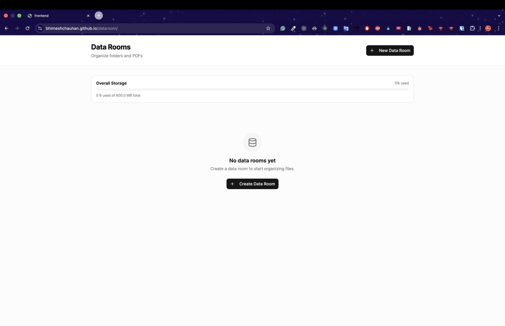
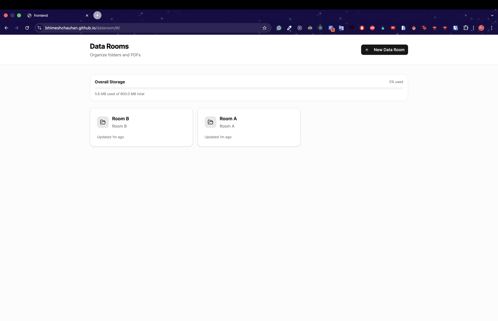
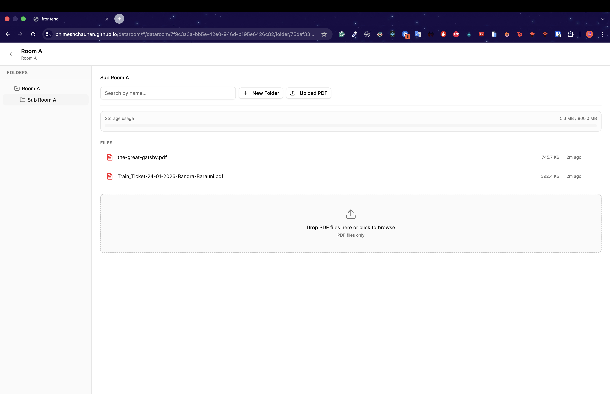
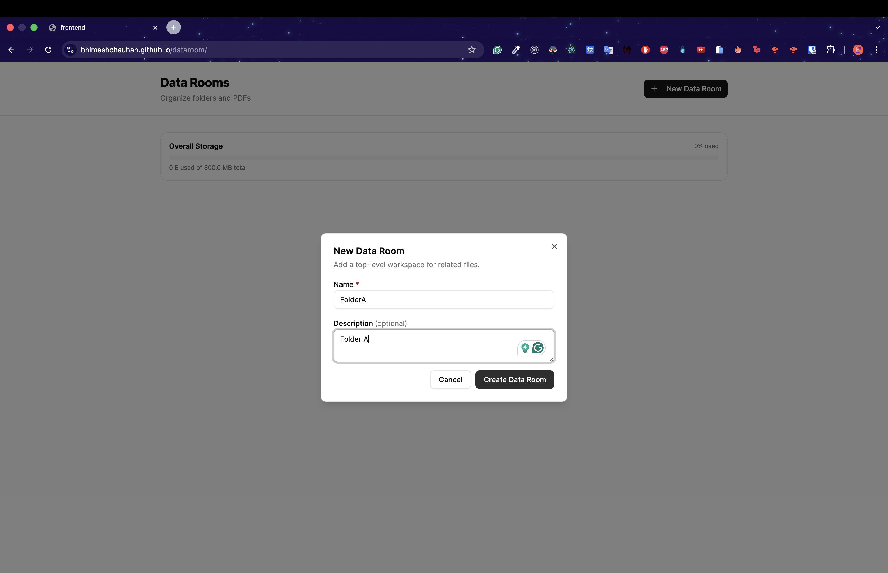
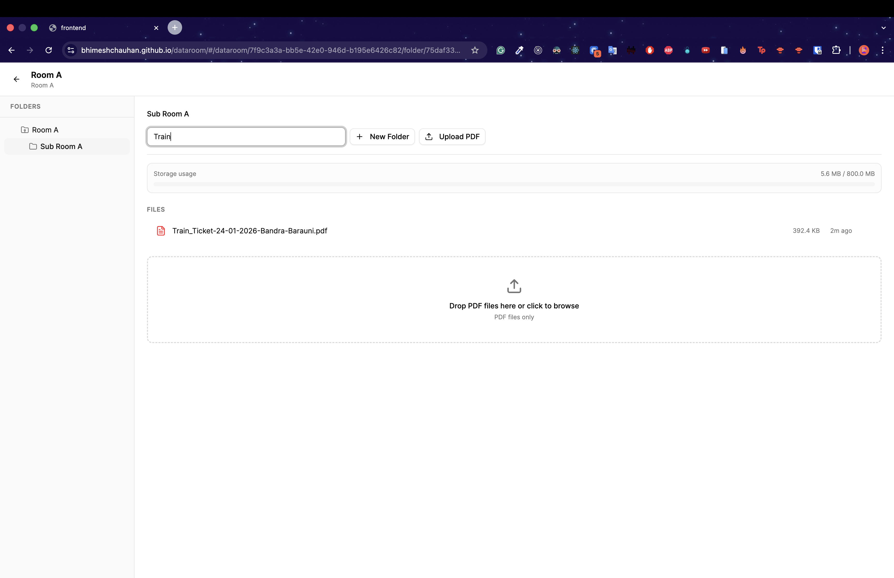
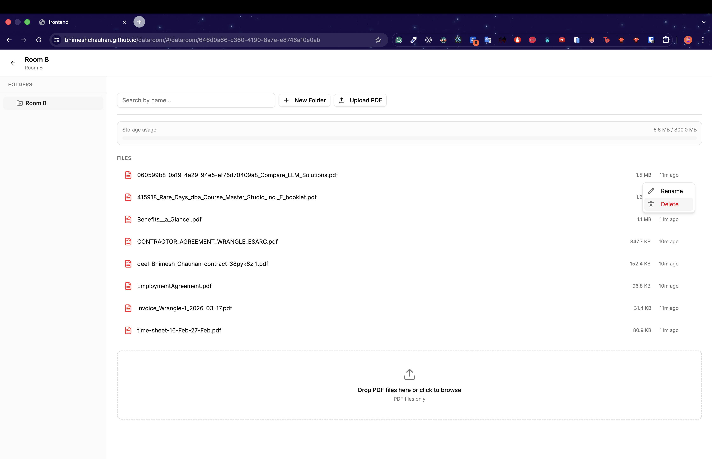
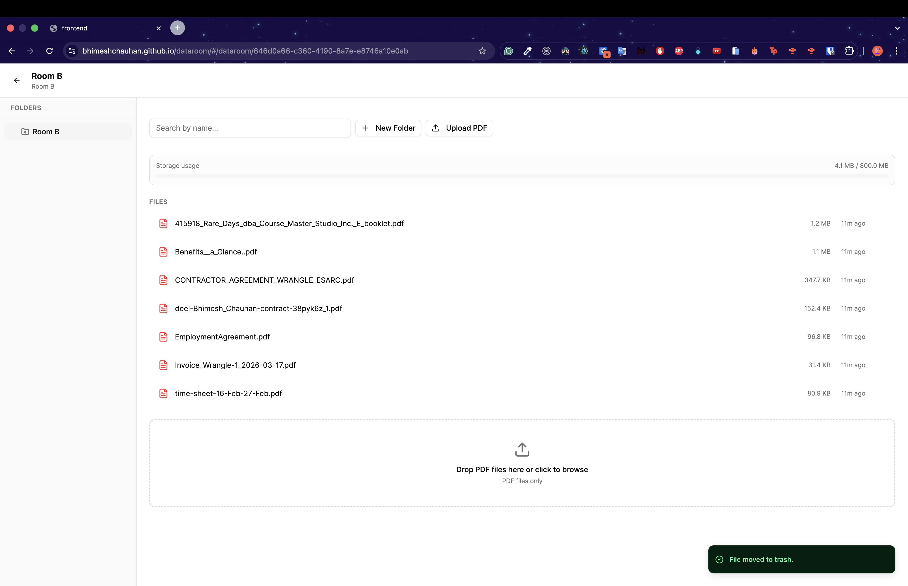
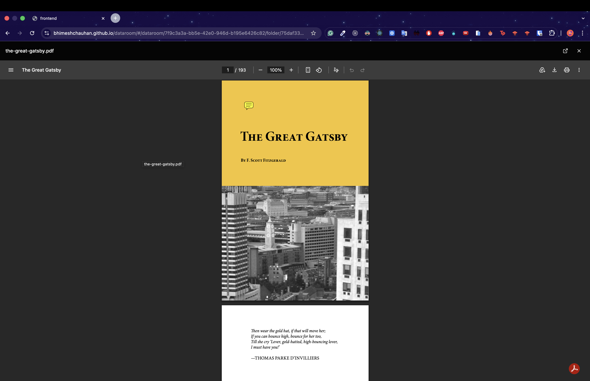

# Data Room

Virtual data room app built for the Harvey take-home exercise.

React + TypeScript + Tailwind (frontend) · Flask + PostgreSQL (backend)

## Quick Start

### Prerequisites
- Docker & Docker Compose
- Node.js 18+ and Python 3.11+ (for local dev without Docker)

### Run with Docker Compose
```bash
docker-compose up --build
# Frontend: http://localhost:5173
# Backend:  http://localhost:5000
# Postgres: localhost:5432
```

### Run Locally (Development)

**Backend:**
```bash
cd backend
python -m venv venv && source venv/bin/activate
pip install -r requirements.txt

# Start Postgres (via Docker or local install)
docker run -d --name dataroom-db \
  -e POSTGRES_DB=dataroom -e POSTGRES_USER=dataroom -e POSTGRES_PASSWORD=dataroom \
  -p 5432:5432 postgres:15-alpine

python wsgi.py  # runs on http://localhost:5000
```

**Frontend:**
```bash
cd frontend
npm install
npm run dev  # runs on http://localhost:5173
```

**Run Tests:**
```bash
cd backend
python -m pytest tests/ -v

cd ../frontend
export VITE_API_URL=http://localhost:5173
npm run test:e2e
```
---
## Live Demo link : https://bhimeshchauhan.github.io/dataroom/
---

## Cloud Demo Deployment

For a zero/low-cost demo setup with GitHub Actions deployments:
- Frontend: GitHub Pages
- Backend: Render
- Database: Neon
- File storage: Render Persistent Disk (`/var/data/storage`)

See the full guide: [`docs/deployment/cloud-demo.md`](docs/deployment/cloud-demo.md)

## Extra Credit Implemented

- Filename/folder name search in current container (`search` query param + UI search bar)

## Video

<div>
  <a href="https://www.loom.com/share/a90c3c4321304106a055b37bea3f87d0">
    <p>Demo</p>
  </a>
  <a href="https://www.loom.com/share/a90c3c4321304106a055b37bea3f87d0">
    
  </a>
</div>

## Screenshots

### Home  
  
### Folder view  
  
### Data room detail  
  
### Folder creation  
  
### Search  
  
### Delete  
  
  
### PDF Viewer  
  

## Design Decisions

### Architecture
- **Separate frontend/backend** - SPA calls REST API. Deploy and scale each service independently.
- **Flask over Django** - Kept the backend small and explicit for this scope.
- **Multiple data rooms** - Each room is an independent top-level container.
- **JWT auth + user ownership** - Users register/login with email+password and can only access their own datarooms/files.

### Database
- **Three tables: datarooms + folders + files** - Simple model for this scope; files can exist at room root or inside folders.
- **Materialized path for nesting** - Folder path stores ancestry (`/uuid1/uuid2/...`) for cheap subtree lookups (`LIKE '/uuid1/%'`).
- **Soft delete with `deleted_at`** - Keeps delete operations recoverable.
- **Partial unique indexes** - Name uniqueness is enforced only for active items in the same parent.

### File Storage
- **Storage abstraction (local or S3-compatible)** - Files are stored with UUID keys and can use local disk (`STORAGE_BACKEND=local`) or object storage (`STORAGE_BACKEND=s3`). No user input ever touches the filesystem key/path.
- **Persistent disk demo setup** - Current Render deployment uses `STORAGE_BACKEND=local` and `STORAGE_PATH=/var/data/storage` backed by a Persistent Disk.
- **Free-plan quota per user** - Total stored bytes are capped per authenticated user (`FREE_STORAGE_QUOTA_BYTES`, default 800MB).
- **Usage visibility in UI** - Dataroom view shows storage usage progress bar (`used / quota`) for the current signed-in user.
- **Triple PDF validation** - Extension + Content-Type + magic bytes (`%PDF`).
- **25MB file size limit** - Configurable via `MAX_FILE_SIZE`. Checked before writing to disk.

### Security & Abuse Protection
- **Simple JWT sessions** - Auth endpoints issue JWTs; protected endpoints require bearer tokens.
- **Per-endpoint rate limiting** - IP-based limits for write and read endpoints.
- **Upload throttle** - `POST /datarooms/:id/files` is limited to `10 requests / 5 minutes / IP`.
- **Mutation limits** - Create/rename/delete endpoints are rate limited.
- **Read limits** - Metadata/list endpoints are rate limited.
- **Security headers** - API responses include `X-Content-Type-Options`, `X-Frame-Options`, `Referrer-Policy`, and `Cross-Origin-Resource-Policy`.
- **Rate-limit config** - Controlled via `RATELIMIT_ENABLED` and `RATELIMIT_STORAGE_URI`.
- **Demo limiter storage** - Defaults to in-memory storage for single-instance demos; production should use Redis (`RATELIMIT_STORAGE_URI=redis://...`).

### Frontend
- **Two-view SPA** - Landing page (data room grid) and detail view (sidebar tree + content panel). State managed in App.tsx with hash-based deep linking.
- **shadcn/ui components** - Reused primitives for consistent styling and basic accessibility.
- **Native PDF iframe viewer** - In-app PDF viewing in a modal iframe, with open-in-new-tab fallback.
- **Refresh after writes** - Folder tree and content panel are refreshed after mutations.
- **Filename search** - Search box filters file/folder names within the currently viewed root folder/folder.

### Scalability Considerations
- **Pagination-ready endpoints** - All list endpoints accept page/per_page parameters.
- **Combined contents pagination** - Folder contents pagination is applied across folders+files combined, so each page contains at most `per_page` total items.
- **Partial indexes** - Index only active rows.
- **Materialized path index** - `text_pattern_ops` btree index enables fast prefix scans for subtree queries.
- **Storage abstraction** - Backend storage service can be swapped from disk to object storage (S3) without schema changes.
- **Stateless backend** - No server-side sessions.

### Future Work
- **Organization model** - Add teams/workspaces, invitations, and role-based access (owner/editor/viewer).
- **Token hardening** - Add refresh tokens + token revocation support for explicit logout-from-all-devices.
- **Centralized rate-limit store** - Use Redis-backed rate limit storage for multi-instance consistency.
- **Full-text search** - Extract PDF text with PyPDF2, index with Postgres tsvector. Search bar in header.
- **Drag-and-drop moving** - Move files/folders between folders via drag in the sidebar or a "Move to..." dialog.
- **File versioning** - Track upload history, allow rollback.
- **Real-time updates** - WebSocket notifications when other users modify the data room.
- **Comprehensive test suite** - Integration tests, E2E with Playwright, frontend component tests.
- **Background jobs** - Celery for hard-delete cleanup, PDF text extraction, thumbnail generation.

## API Reference

### Live: https://dataroom-api-8z73.onrender.com/api/docs

Base URL: `/api/v1`

Protected endpoints require:
`Authorization: Bearer <token>`

| Method | Endpoint | Description |
|--------|----------|-------------|
| POST | `/auth/register` | Register user and return JWT |
| POST | `/auth/login` | Login user and return JWT |
| GET | `/auth/me` | Get current authenticated user |
| POST | `/datarooms` | Create a data room |
| GET | `/datarooms` | List all data rooms |
| GET | `/datarooms/:id` | Get a data room |
| PATCH | `/datarooms/:id` | Rename/update a data room |
| DELETE | `/datarooms/:id` | Soft-delete a data room + all contents |
| GET | `/datarooms/:id/contents` | List root-level folders + files (supports `search`) |
| GET | `/datarooms/:id/tree` | Get folder tree for sidebar |
| GET | `/health` | Health check endpoint |
| POST | `/datarooms/:id/folders` | Create a folder |
| GET | `/folders/:id/contents` | List folder contents (supports `search`) |
| PATCH | `/folders/:id` | Rename a folder |
| DELETE | `/folders/:id` | Soft-delete folder + all descendants |
| POST | `/datarooms/:id/files` | Upload a PDF file |
| GET | `/files/:id` | Get file metadata |
| GET | `/files/:id/content` | Stream PDF for viewing |
| PATCH | `/files/:id` | Rename a file |
| DELETE | `/files/:id` | Soft-delete a file |

## Tech Stack

| Layer | Technology |
|-------|-----------|
| Frontend | React 18, TypeScript, Vite, Tailwind CSS v4, shadcn/ui, lucide-react |
| Backend | Flask 3.1, SQLAlchemy, Flask-Migrate, Gunicorn, boto3 |
| Database | PostgreSQL 15 |
| Testing | Pytest + Playwright smoke |
| Containerization | Docker, Docker Compose |

## Edge Cases Handled

- **Same filename in folder** - Returns 409 from DB constraint.
- **Delete non-empty folder** - Cascading soft-delete of descendants.
- **Invalid file upload** - Triple validation (extension + content-type + magic bytes)
- **Path traversal** - UUID-only filenames on disk; no user input in filesystem paths
- **Deep folder nesting** - Materialized path + breadcrumb reconstruction.
- **Refresh persistence** - State persists in Postgres; URL hash restores view.
- **Large files** - Rejected before saving; configurable size limit (default 25MB)
- **Concurrent name conflicts** - Database-level unique constraints prevent race conditions
